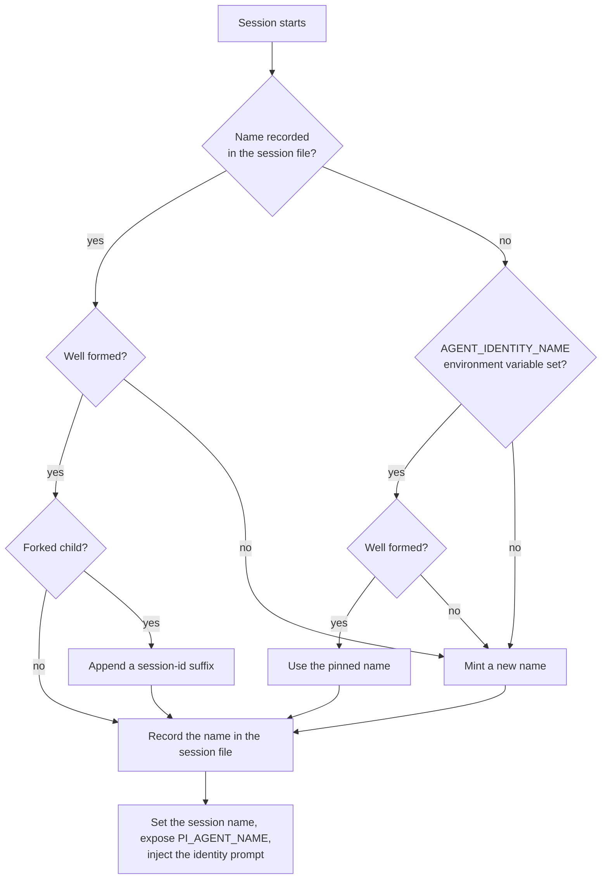

# pi-agent-name

Standalone agent names for pi sessions: a persistent, human-readable identity
such as `swift-koala-42`, with **no daemon, no socket, and no intercom
dependency**.

## What a name does

The extension gives every pi session one name and puts it to work:

| Surface | Effect |
|---|---|
| Session name | The session is named after the agent, so a window is identifiable at a glance |
| System prompt | Identity rules are injected, so the agent signs its work consistently |
| `PI_AGENT_NAME` | Every shell command the agent runs can read its own name |
| Git commits | A `Co-authored-by` trailer is added to each commit automatically |
| `/whoami` | Prints the current name |
| `session_rename` tool | Renames the session to `<agent-name>: <task>` without losing the name prefix |

## Install

```bash
pi install git:github.com/elecnix/pi-agent-name
```

## How it works

A name is minted locally and stored in the session file, which is the only
source of truth. There is no registry to consult and no process to keep alive.



1. **Restore first.** The name is read back from the session file, so a reload
   or a resumed conversation keeps the identity it already had.
2. **Fork disambiguation.** A forked subtask copies its parent's entries,
   including the name. The child is re-identified with a deterministic suffix
   derived from its own session id, so parent and child never run as one name.
3. **Mint last.** A new session takes `AGENT_IDENTITY_NAME` when it is set and
   well formed, and otherwise mints a name from the vocabulary.

## Collision risk

Uniqueness rests on the size of the name space, not on a registry. A name is an
adjective, an animal, and a number from 0 to 99:

| Pool | Count |
|---|---|
| Adjectives | 229 |
| Animals | 229 |
| Suffixes | 100 |
| **Names** | **5,244,100** |

A fresh draw therefore matches one particular existing name with probability
`1 / 5,244,100`, which is **1.9 × 10⁻⁷** — about one in five million, well
below the one-in-a-million target. Against a fleet of `n` live agents the chance
of sharing *some* name is `n × 1.9 × 10⁻⁷`: still under one in ten thousand for
fifty concurrent sessions.

Collisions are reduced, never eliminated. Two sessions started in the same
instant can independently draw the same name, and nothing detects it
afterwards. That is the deliberate trade for having no registry.

## Standalone by construction

The extension imports nothing beyond the Node standard library and the pi
extension API. It opens no socket, starts no child process, and writes no files
outside the session. Stopping pi stops everything the extension does.

## Using it alongside pi-agent-identity

Both extensions can be installed. They record the name under a shared
`agent-identity-name` session entry as well as their own, so a session that was
named by one is adopted by the other instead of minting a second identity. They
also both write the same `<agent_identity>` prompt tag, so the identity block is
never injected twice.

The larger extension adds intercom addressing, offline revival, and mention
tracking on top of the same name. Install this one when a name is all you want.

## Development

The test suite uses the Node test runner and type stripping, with no
dependencies to install:

```bash
npm test
```

## License

No license file is included yet.
